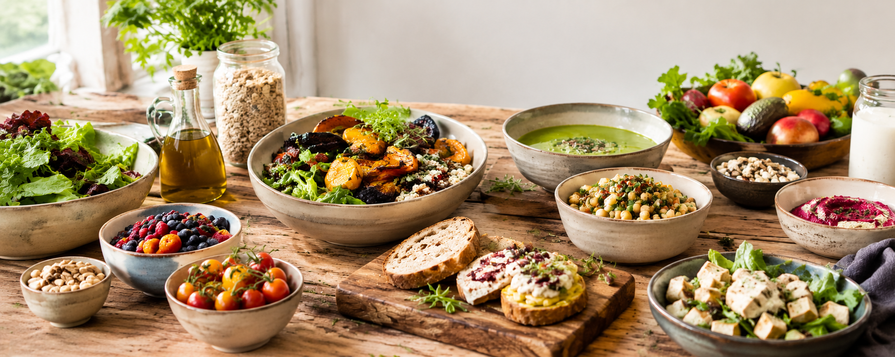
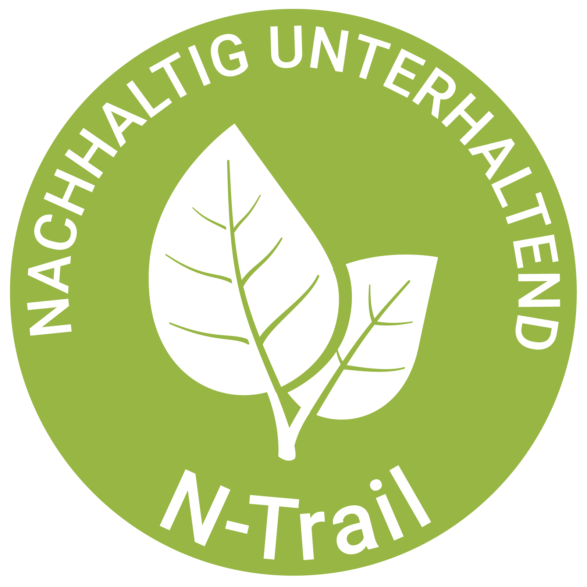

# N-Trail Station UI

Reusable design system for smartphone-first "Posten" (station) pages in the
N-Trail look: quiet, factual, nature-toned, generous whitespace, one action per
screen, no alarm styling. **Designed at 320 px**; grows gently up to ~768 px
(portrait tablet), then caps. Works for any station.

## Hard rules

- **Vanilla only.** HTML + CSS + JS, no framework, no build tool, no bundler.
- **Files:** `index.html` (structure), `style.css` (look), `script.js`
  (behaviour), `daten.json` (content/data).
- **All data lives in `daten.json` — always.** Any text that changes, dish list,
  CO₂ value, question, answer, caption, or swap suggestion goes in `daten.json`;
  `script.js` fetches it and renders. Never hard-code content or arrays into
  HTML or JS. Repeated markup (tiles, answers, bars) is generated from data, not
  copy-pasted.
- **Patch-friendly for Claude & humans:** no minification; short, named
  functions; one concern per file; unique stable `id`/`data-*` anchors so edits
  are surgical; mark CSS sections with `/* === name === */`; no clever
  one-liners or duplicated blocks.
- **No server, no storage, no accounts.** State is a session-only JS variable,
  gone on reload.
- **Multi-step without reloads:** toggle `.step` sections in JS.
- Drag ordering: **SortableJS via CDN**. Bar charts: `div` bars with JS-set
  width — no chart library. Reminder: a client-side-generated `.ics` file
  (Blob download), no backend.
- Ship as flat files; link from the main site with a normal link/QR, not iframe.

## Typography — the only five content-text styles

All **readable page text** uses exactly one of these five styles — nothing else
(no extra sizes, no grey body text). Font is **Lato** throughout. Sizes are the
**320-px base**; they scale gently and cap at ~768 px (see `--fs-*` tokens).
Line-heights are unitless, so they hold at every width.

| Style       | Where                     | Weight          | Size 320→768 px | Line-height | Colour |
|-------------|---------------------------|-----------------|-----------------|-------------|--------|
| Haupttitel  | hero title only           | Lato Black 900  | 26 → 32.5       | 1.1         | #FFF   |
| Titel       | headings (`h1`/`h2`/`h3`) | Lato Bold 700   | 16 → 20         | 1.3         | #000   |
| Text        | body copy + footer ©      | Lato Regular 400| 16 → 20         | 1.4         | #000   |
| Impressum   | footer legal links        | Lato Black 900  | 16 → 20         | 1.4         | #000   |
| Hinweis     | data/source notes, captions | Lato Regular 400 | 13 → 16.25   | 1.2         | #000   |

Titel and Text are the **same size** — they differ only by weight. **Hinweis** is
the one smaller style: it carries notes on where the numbers come from, figure
captions and credits, and the quiet "(kleiner Hinweis)" lines the concept marks
as such — never a screen's main copy, and never an instruction the person has to
follow to get on (a drag-and-drop or tap instruction stays **Text**). Everything
that is *read* (prose, hints, captions, quiz text, take-away sentence) is one of
these five; black `#000`, never grey.

**Exception — functional chrome.** Buttons, the header menu, and form fields
keep their working look (green CTA with white label, quiet secondary buttons) and
simply borrow `--fs-base` so their size scales with the rest. They are not one of
the five text styles.

## Tokens

Top of `style.css`. Brand values fixed; `/* derived */` = tune to the live site.

```css
:root{
  /* === brand (measured from the live site) === */
  --font:'Lato',-apple-system,BlinkMacSystemFont,'Segoe UI',Roboto,sans-serif;
  --brand:#89A931;                   /* logo + green accent */
  --cta:#4E6805;                     /* dark olive: primary button + menu items */
  --panel:#EAE7E7;                   /* dropdown + footer panel */
  /* === type: gentle fluid scale, 320-px base → capped at 768 px (×1.25) === */
  --fs-hero:clamp(26px, calc(26px + 6.5 * (100vw - 320px) / 448), 32.5px); /* Haupttitel 26→32.5 */
  --fs-base:clamp(16px, calc(16px + 4   * (100vw - 320px) / 448), 20px);   /* Titel/Text/Impressum 16→20 */
  --fs-hinweis:clamp(13px, calc(13px + 3.25 * (100vw - 320px) / 448), 16.25px); /* Hinweis 13→16.25 */
  /* === derived (tune) === */
  --cta-hover:#3E5304; --text:#000; --muted:#6B6B6B; /* --muted: icons/hairlines ONLY, never readable copy */
  --bg:#FFFFFF; --surface:#F4F5EF; --border:#E3E3DD; --track:#EFF0EA;
  --maxw:680px; --radius:6px; --space:1rem; --hdr-h:56px; --thumb:56px;
}
*{box-sizing:border-box}
html{font-size:16px}                 /* rem = 16 px fixed; only type scales, via --fs-* */

/* Text — default body copy (+ footer ©) */
body{margin:0;font-family:var(--font);font-weight:400;font-size:var(--fs-base);
  line-height:1.4;color:var(--text);background:var(--bg)}

/* Titel — headings (same size as Text, heavier) */
h1,h2,h3{margin:1.5rem 0 .75rem;font-family:var(--font);font-weight:700;
  font-size:var(--fs-base);line-height:1.3;color:#000}

/* Hinweis — data/source notes and figure captions (smaller, still black) */
.hinweis,.fig figcaption{font-family:var(--font);font-weight:400;
  font-size:var(--fs-hinweis);line-height:1.2;color:#000}

a{color:var(--cta)}
img{max-width:100%;height:auto;display:block}
.container{max-width:var(--maxw);margin:0 auto;padding:0 var(--space)}
:focus-visible{outline:3px solid var(--brand);outline-offset:2px}
.sr-only{position:absolute;width:1px;height:1px;overflow:hidden;clip:rect(0 0 0 0)}
```

Fonts — self-host in `css/` (woff2 + woff, `font-display:swap`): **Lato**
Regular 400 (Text, Hinweis), **Bold 700** (Titel), **Black 900** (Haupttitel,
Impressum).
No other family — Fira Sans is not used.

## Page order

White sticky header (logo = Home · ☰ hamburger → Anleitung/FAQ/Karte) →
full-bleed ~2:1 hero with the station title overlaid in white (Haupttitel,
lower-left) → single column (`h2`, prose, figures with caption **only where a
source requires it**, one green action) → grey footer panel (Impressum ·
Datenschutz · © · N-Trail logo).
An optional info-button + pop-up and a cookie banner may be added; omit the
info-button entirely if the station has no pop-up target. Hero image, sponsor
logos and own illustrations carry **no credit**.

Principles: one column, one idea, one action per screen; **design at 320 px**;
between 320 and ~768 px the single column fills the width (up to `--maxw`) and
type grows gently, then centres and caps; calm surfaces, hairline borders, no
heavy cards or shadows. **No grey bar under the hero, none above the footer.**

## Components

```html
<!-- header: white bar · logo=Home · (optional info-button) · hamburger→dropdown -->
<header class="hdr">
  <a class="hdr-logo" href="index.html"></a>
  <!-- optional: omit the info-button entirely if the station has no pop-up
  <button class="hdr-info" type="button" data-popup="info">Was ist der Klimaweg?</button> -->
  <nav class="hdr-menu">
    <button class="hdr-burger" aria-expanded="false" aria-controls="menu"><span class="sr-only">Menü</span></button>
    <!-- menu links: absolute URLs to the live site (exact per-station paths from the concept) -->
    <ul id="menu" class="menu" hidden>
      <li><a href="https://n-trail.org/Basel/bs_anleitung.html">Anleitung</a></li>
      <li><a href="https://n-trail.org/Basel/bs_faq.html">FAQ</a></li>
      <li><a href="https://n-trail.org/Basel/uebersichtskarte_basel.html">Karte</a></li>
    </ul>
  </nav>
</header>

<div class="hero">                                          <!-- full-bleed hero + overlaid Haupttitel, no credit, no bar -->
  
  <h1 class="hero-title">Klimawandel in der Schweiz</h1>
</div>

<figure class="fig">                                        <!-- figure; add credit ONLY when a source requires it -->
  
  <figcaption>Bildunterschrift<span class="credit">© Name, Jahr</span></figcaption>
</figure>

<!-- menu list: one row per dish — app-icon-size picture left, name right.
     A pair of variants stays collapsed to one picture + title and opens on tap. -->
<div class="menulist">                                      <!-- rows generated from data -->
  <button class="menu-row" type="button" data-nr="3">
    
    <span class="menu-row-name">Schnitzel mit Pommes</span>
  </button>
  <div class="menu-group">
    <button class="menu-row menu-row--toggle" type="button" aria-expanded="false" aria-controls="grp-pizza">
      
      <span class="menu-row-name">Pizza</span>
    </button>
    <div class="menu-group-body" id="grp-pizza" hidden>
      <p class="menu-frage">Isst du meistens … mit Fleisch … oder ohne Fleisch …?</p>
      <div class="menulist"><!-- the two variant rows, meat first, nothing pre-selected --></div>
    </div>
  </div>
</div>

<a class="btn btn-primary" href="next.html">Weiter</a>      <!-- primary action (functional chrome) -->
<div class="answers"></div>                                 <!-- filled from data -->

<!-- footer: grey panel · legal links · copyright · logo=Home (no grey bar on top) -->
<footer class="ftr">
  <div class="ftr-inner">
    <div class="ftr-text">
      <p class="ftr-legal">
        <a href="https://n-trail.org/Basel/bs_impressum.html">Impressum</a>
        <a href="https://n-trail.org/Basel/bs_datenschutzerklarung.html" class="noConsent">Datenschutz</a>
      </p>
      <p class="ftr-copy">© <span id="year">2026</span> Dialog N &amp; PUNK</p>
    </div>
    <a class="ftr-logo" href="index.html" aria-label="N-Trail — Home">
      
    </a>
  </div>
</footer>
```

```css
/* === header (white bar) === */
.hdr{position:sticky;top:0;z-index:20;display:flex;align-items:center;gap:.5rem;
  min-height:var(--hdr-h);padding:0 var(--space);background:var(--bg);
  padding-top:env(safe-area-inset-top,0)}
.hdr-logo img{width:40px;height:40px;display:block}           /* square logo (fixed px) */
/* optional info-button (functional chrome, Lato):
   .hdr-info{min-height:40px;padding:.4rem 1rem;border:0;border-radius:999px;cursor:pointer;
     color:#fff;background:var(--brand);font-family:var(--font);font-weight:700;
     font-size:var(--fs-base);line-height:1.15;text-align:center} */
.hdr-menu{margin-left:auto;position:relative}
.hdr-burger{width:44px;height:44px;border:0;cursor:pointer;background:transparent
  url(images/hamburger-gray.png) center/24px no-repeat}
.menu{position:absolute;right:0;top:100%;margin:.25rem 0 0;padding:.5rem 0;list-style:none;
  min-width:60vw;background:var(--panel);border-radius:var(--radius);box-shadow:0 2px 8px rgba(0,0,0,.15)}
.menu a{display:block;padding:.6rem 1.25rem;text-decoration:none;color:var(--cta);
  font-family:var(--font);font-weight:700;font-size:var(--fs-base);line-height:1.3} /* functional nav, dark green */
.menu a:hover,.menu a:focus-visible{background:rgba(0,0,0,.05)}

/* === hero (Haupttitel; no scrim, no grey bar) === */
.hero{position:relative}
.hero img{width:100%;aspect-ratio:766/379;object-fit:cover;display:block} /* ≈2:1, full-bleed */
.hero-title{position:absolute;left:0;bottom:0;margin:0;padding:.35em .5em;
  color:#fff;font-family:var(--font);font-weight:900;font-size:var(--fs-hero);line-height:1.1;
  text-shadow:0 1px 3px rgba(0,0,0,.55)}  /* keeps the white title legible on light photos — a shadow, not a bar */

/* === figure === */
.fig{margin:1.5rem 0}.fig img{border-radius:var(--radius)}
.fig figcaption{margin-top:.5rem}                             /* Hinweis (set in the tokens block) */
.credit{display:block;margin-top:.15rem}

/* === menu list (picker + suggestion lists): picture left, name right === */
.menulist{display:flex;flex-direction:column;gap:.5rem;margin:1rem 0}
.menu-row{display:flex;align-items:center;gap:.75rem;width:100%;min-height:48px;
  padding:.5rem .75rem;background:var(--bg);border:1px solid var(--border);
  border-radius:var(--radius);cursor:pointer;text-align:left;
  font-family:var(--font);font-weight:700;font-size:var(--fs-base);line-height:1.3;color:#000}
.menu-row:hover,.menu-row:focus-visible{border-color:var(--brand)}
.menu-thumb{flex:0 0 var(--thumb);width:var(--thumb);height:var(--thumb);
  border-radius:12px;object-fit:cover;background:var(--surface)}  /* app-icon size (--thumb:56px) */
.menu-row-name{flex:1 1 auto}
.menu-group{border:1px solid var(--border);border-radius:var(--radius);background:var(--surface)}
.menu-group > .menu-row{background:transparent;border:0;border-radius:var(--radius)}
.menu-row--toggle::after{flex:0 0 auto;color:var(--muted);font-size:1.1rem;line-height:1}
.menu-row--toggle[aria-expanded="false"]::after{content:"▾"}
.menu-row--toggle[aria-expanded="true"]::after{content:"▴"}
.menu-group-body{padding:0 .75rem .75rem}
.menu-group-body .menu-frage{margin:0 0 .5rem}
.menu-group-body .menulist{margin:0}
.menulist--static .menu-row{cursor:default}                   /* display-only lists */
.menulist--static .menu-row:hover{border-color:var(--border)}

/* === buttons (functional chrome — not one of the five text styles) === */
.btn{display:block;width:100%;min-height:48px;padding:.9rem 1.25rem;text-align:center;
  border:1px solid transparent;border-radius:var(--radius);cursor:pointer;text-decoration:none;
  font-family:var(--font);font-weight:700;font-size:var(--fs-base);line-height:1.2}
.btn-primary{background:var(--cta);color:#fff;margin:1.5rem 0}
.btn-primary:hover,.btn-primary:focus-visible{background:var(--cta-hover)}
.answers{display:flex;flex-direction:column;gap:.75rem}
.btn-answer{background:var(--surface);color:#000;border-color:var(--border);font-weight:400;text-align:left}
.btn-answer:hover,.btn-answer:focus-visible{border-color:var(--brand)}

/* === footer (grey panel — NO grey bar on top) === */
.ftr{margin-top:2.5rem;background:var(--panel);padding-bottom:env(safe-area-inset-bottom,0)}
.ftr-inner{max-width:var(--maxw);margin:0 auto;padding:1.5rem var(--space);display:flex;
  flex-wrap:wrap;align-items:center;justify-content:space-between;gap:1rem}
.ftr-legal{margin:0 0 .25rem}                                 /* Impressum */
.ftr-legal a{color:#000;text-decoration:none;margin-right:1.25rem;
  font-family:var(--font);font-weight:900;font-size:var(--fs-base);line-height:1.4}
.ftr-copy{margin:0;color:#000;                                /* Text */
  font-family:var(--font);font-weight:400;font-size:var(--fs-base);line-height:1.4}
.ftr-logo img{width:96px;height:96px;display:block}           /* footer logo (raster Footer_logo.png), fixed px */
```

## Interactive patterns

```js
// state is session-only, never persisted
const state={};

// content comes from daten.json — nothing hard-coded
let DATA;
async function boot(){ DATA=await (await fetch('daten.json')).json(); render(); showStep(1); }
boot();

// multi-step, no reload
const steps=[...document.querySelectorAll('.step')];
function showStep(n){steps.forEach(s=>s.hidden=+s.dataset.step!==n);scrollTo({top:0});}

// header hamburger: toggle dropdown, close on outside click
const burger=document.querySelector('.hdr-burger'), menu=document.getElementById('menu');
burger.addEventListener('click',()=>{const open=menu.hidden;menu.hidden=!open;burger.setAttribute('aria-expanded',String(open));});
document.addEventListener('click',e=>{if(!e.target.closest('.hdr-menu')){menu.hidden=true;burger.setAttribute('aria-expanded','false');}});

// footer year
const y=document.getElementById('year'); if(y) y.textContent=new Date().getFullYear();

// render repeated markup from data (answers, tiles…)
function render(){
  document.querySelector('.answers').innerHTML =
    DATA.antworten.map(a=>`<button class="btn btn-answer" data-id="${a.id}">${a.text}</button>`).join('');
}

// menu list: open/close a variant pair (nothing pre-selected, meat variant first)
function toggleGroup(btn){
  const body=document.getElementById(btn.getAttribute('aria-controls'));
  const open=body.hidden; body.hidden=!open; btn.setAttribute('aria-expanded',String(open));
}

// reveal bars: neutral & ordinal — one colour, length carries meaning, never red
// Linear scale against the LARGEST value, so the ratios are true and nothing is
// capped; a tiny value keeps a visible nub via .bar-fill{min-width:6px} and its
// number is printed underneath.
// const max=Math.max(...werte); breite = wert/max*100;
// <div class="bar"><span class="bar-label">…</span>
//   <div class="bar-track"><div class="bar-fill" style="width:60%"></div></div>
//   <p class="bar-value">≈ 1 790 g CO₂-Äq.</p></div>

// drag ordering (add <script src=".../sortablejs@1/Sortable.min.js"> in HTML)
new Sortable(document.getElementById('sortlist'),{animation:150});

// self-reminder as a downloadable .ics calendar file — fully client-side, nothing stored
function icsEsc(s){return String(s).replace(/[\\;,]/g,m=>'\\'+m).replace(/\n/g,'\\n');}
function icsDate(d){return d.toISOString().replace(/[-:]/g,'').split('.')[0]+'Z';} // UTC: 20260110T080000Z
// SUMMARY stays short and recognisable ("Mein Klima-Vorsatz"); DESCRIPTION carries
// the full sentence plus context. VALARM with TRIGGER:PT0S fires the reminder AT
// the moment itself, not before.
function buildIcs(titel,beschreibung,start,minutes=15){
  const end=new Date(start.getTime()+minutes*60000);
  return ['BEGIN:VCALENDAR','VERSION:2.0','PRODID:-//N-Trail//Posten//DE','CALSCALE:GREGORIAN',
    'BEGIN:VEVENT',
    'UID:'+Date.now()+'@n-trail','DTSTAMP:'+icsDate(new Date()),
    'DTSTART:'+icsDate(start),'DTEND:'+icsDate(end),
    'SUMMARY:'+icsEsc(titel),'DESCRIPTION:'+icsEsc(beschreibung),
    'BEGIN:VALARM','ACTION:DISPLAY','TRIGGER:PT0S','DESCRIPTION:'+icsEsc(titel),'END:VALARM',
    'END:VEVENT','END:VCALENDAR'
  ].join('\r\n'); // RFC 5545 needs CRLF
}
function downloadIcs(titel,beschreibung,start){
  const url=URL.createObjectURL(new Blob([buildIcs(titel,beschreibung,start)],{type:'text/calendar'}));
  const a=document.createElement('a'); a.href=url; a.download='erinnerung.ics'; a.click();
  URL.revokeObjectURL(url);
}
```

```css
/* === bars (structural; text inside uses Titel/Text) === */
.bar{display:grid;grid-template-columns:8rem 1fr;align-items:center;gap:.5rem;margin:.4rem 0}
.bar-label{font-weight:700;color:#000}                        /* Titel weight */
.bar-fill{height:1.5rem;border-radius:var(--radius);background:var(--brand);transition:width .6s ease}
@media(prefers-reduced-motion:reduce){.bar-fill{transition:none}}
```

`daten.json` shape (everything editable without touching code):

```json
{
  "gerichte":[{"name":"Cheeseburger","vorschlag":"Bean-Burger","halb":"halb Hack, halb Bohnen"}],
  "antworten":[{"id":"a","text":"3–5 Geschäfte"},{"id":"b","text":"6–10 Geschäfte"}]
}
```

The reminder date is user-choosable via a date/time input; **default the `start`
to one week ahead, editable by the person** (pass the chosen `Date` into
`buildIcs(titel,beschreibung,start)`). Show the same wording the `.ics` carries
as a **preview the person can copy** (title, date, sentence) with a "Text
kopieren" button — `navigator.clipboard.writeText` with a hidden-textarea
fallback — so a failed import is no dead end. The `.ics` download also needs its
plain-text fallback line ("Funktioniert das nicht? Füge dir die Erinnerung selbst
im Kalender hinzu.") — behaviour varies by device (iOS usually opens Calendar
import; some Android browsers just save the file). Test on real iOS/Android.

## Do / Don't

- **Do:** calm, factual, one green accent; one action per screen; skippable, nothing
  required; caption + credit **only where a source requires it** (hero, sponsor
  logos and own illustrations need none); readable text is always one of the five
  styles in black; tap targets ≥48px; visible `:focus-visible`; `alt` text;
  respect `prefers-reduced-motion`; Swiss German copy ("ss", not "ß"), simple,
  not childish.
- **Don't:** no sixth text style, no grey body copy, no font size outside the five;
  **no grey bar under the hero or above the footer**; no hero scrim; no
  red/traffic-light colours, shaming, or catastrophe framing (reveal is a neutral
  scale, not a verdict); no heavy cards/shadows/gradients; no
  registration/tracking/persistence; no two competing buttons; no second accent
  colour; no content in HTML/JS (see hard rules).

## Skeleton

```
posten/
├─ index.html   header · hero · .step sections · footer (structure only)
├─ style.css    tokens + five text styles + components above
├─ script.js    boot(), showStep(), menu toggle, render(), Sortable, downloadIcs()
├─ daten.json   all dishes, texts, questions, answers, values
├─ css/         self-hosted fonts: Lato-Regular (400), Lato-Bold (700), Lato-Black (900) — .woff2/.woff
└─ images/      Header_logo.png (header), Footer_logo.png (footer), hamburger-gray.png, hero.png…
```
`<head>`: `<meta name="viewport" content="width=device-width,initial-scale=1,shrink-to-fit=no,viewport-fit=cover">`,
stylesheet, `@font-face` for Lato 400/700/900.

**Confirm with the live site:** header height (live bar is 41→98px scaled; the
skill uses a fixed accessible 56px), footer logo size (live 180px desktop; skill
uses 96px), exact `--radius`/`--maxw`, and the derived greys. The five text
styles, the 320-px base with gentle capped scaling, and the removed grey bars are
fixed per the brief — don't re-introduce a hero scrim or a footer top rule.
